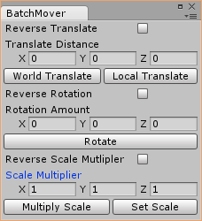

# Unity-BatchMover
A simple editor script to help with batch translation, rotation and scaling. 

## Getting Started
1. Copy contents of Assets folder to your project directory.
2. Access through the Unity Menu by navigating to Window > Batch Mover.

Protip: You can place [BatchMover.cs](Assets/Scripts/Editor/BatchMover.cs) anywhere in your Assets folder.

## Features

- Translate in World or Local space
- Rotate
- Multiply or Set Scale
- Easy reversal of translation, rotation, or scale multiplication 
